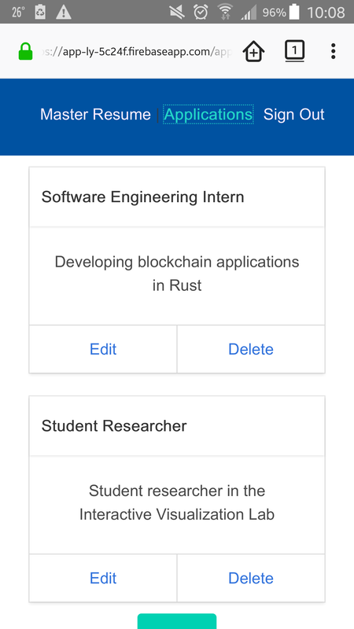
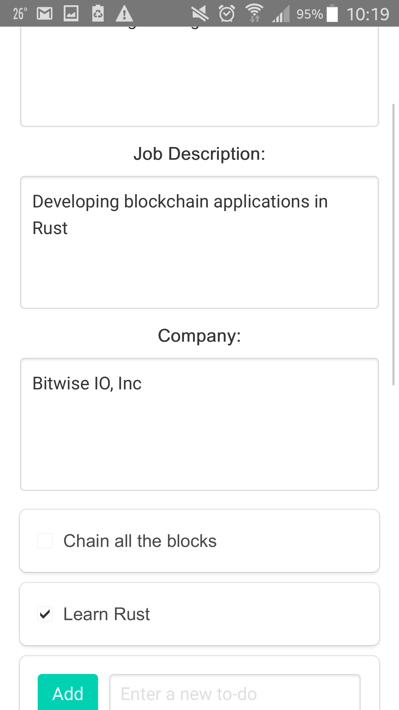
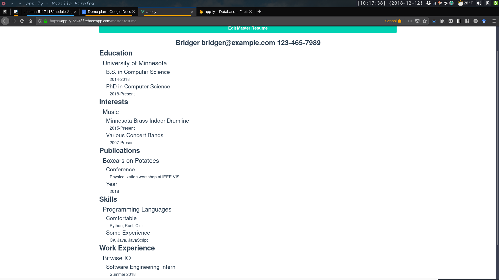
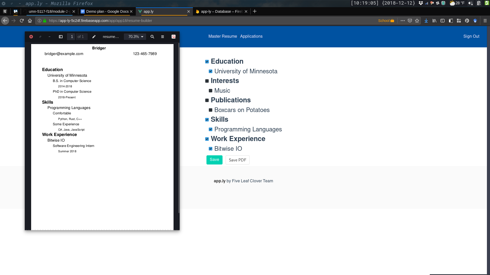

# Module 2 Group Assignment

CSCI 5117, Fall 2018, [assignment description](https://docs.google.com/document/d/1NN_rCSks6TT1TS7TaVXFsRIBCYeqs5MUa4ijEN-Vhoo/edit)

## App Info:

* Team Name: 5 Leaf Clover
* App Name: app.ly
* App Link: http://app-ly-5c24f.firebaseapp.com

### Students

* Bridger Herman
* Kate Kuehl
* Nikki Kyllonen
* Jinshi Lu
* Emily Moeller

## Key Features

**Describe the most challenging features you implemented
(one sentence per bullet, maximum 4 bullets):**

* Parsing the JSON from the database for a displayable format on the master resume on the website
* Making the Resume Builder which creates a pdf out of the resume data
* Integrating the camera
* Complicated database organization

Which device integration(s) does your app support?

* Camera: The camera works for mobile, and it's an upload button in the browser.

Which progressive web app feature(s) does your app support?

* Add to Home Screen

## Testing Notes

**Is there anything special we need to know in order to effectively test your app? (optional):**

* Nope

## Screenshots of Site

**[Add a screenshot of each key page (maximum 4)](https://stackoverflow.com/questions/10189356/how-to-add-screenshot-to-readmes-in-github-repository)
along with a very brief caption:**

## Paper Prototype

**[Add images/photos that show your paper prototype (maximum 4)](https://stackoverflow.com/questions/10189356/how-to-add-screenshot-to-readmes-in-github-repository) along with a very brief caption:**

Progression through the mobile version of the app

Progression through the Desktop version of the app

## External Dependencies

**Document integrations with 3rd Party code or services here.
Please do not document required libraries (e.g., Vue, Vuefire, Firebase).**

- jsPDF: Generating PDFs of the custom resumes for each application

**If there's anything else you would like to disclose about how your project
relied on external code, expertise, or anything else, please disclose that
here:**

...
